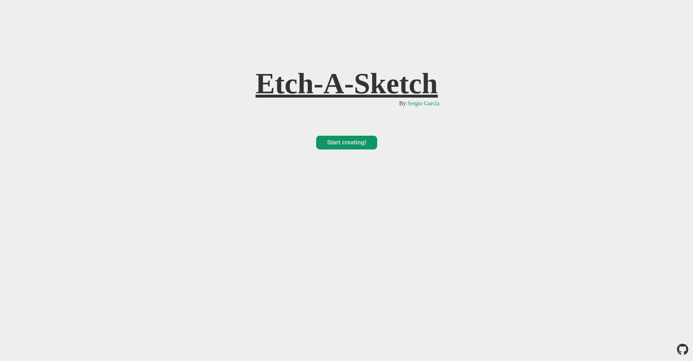
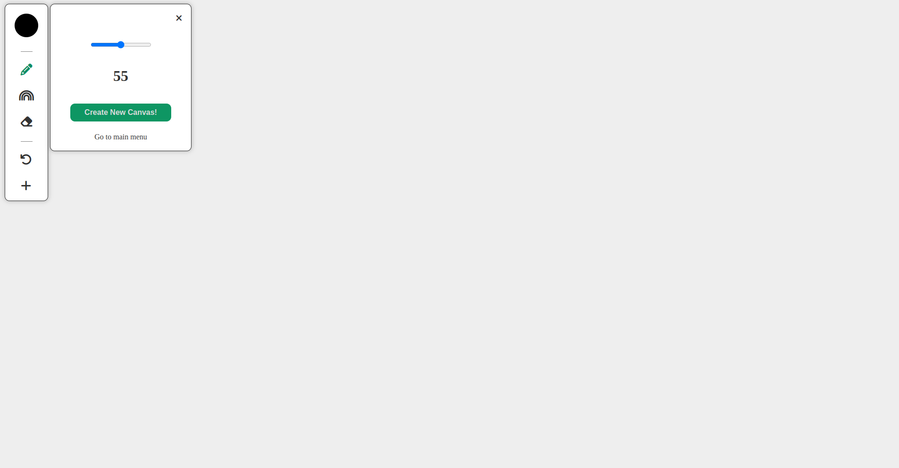
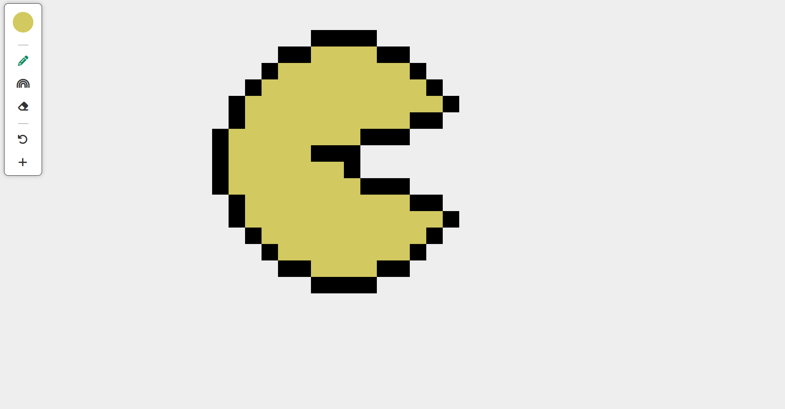
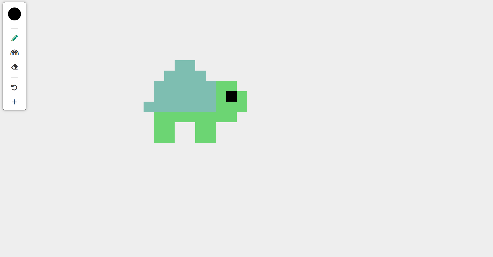
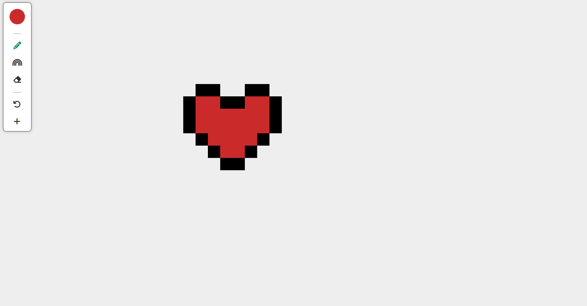

# Etch-A-Sketch

Etch-A-Sketch created with html, css and js

## About the app

The project is from [The Odin Project](https://www.theodinproject.com/lessons/foundations-etch-a-sketch) curriculum.

### Features

- It has a color mode, rainbow mode and erase mode
- It has a reset button
- The pixel size can be changed from 10px to 100px
- It's not support responsive design ([app screenshots](#screenshots))

### Tools and technology

- Visual Studio Code
- Linux Terminal
- Font Awesome Icons
- Figma
- Git and GitHub
- HTML and CSS
- JavaScript

## Screenshots

### Main menu

### New canvas menu

### Some examples

## Author

[Sergio García](https://github.com/sergiogarciiam)

## License

This project is open source and available under the [MIT License](./LICENSE).
